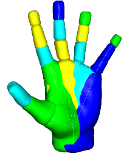

# Implicit Skinning: Deformation with Cloth and Skin Contact Modelling
## CSC2521: Geometry Processing Final Project

> **To get started:** Fork this repository then issue
> 
>     git clone --recursive http://github.com/[username]/Geometry-Processing-Final-Project.git
>

## Installation and Compilation

See
[introduction](http://github.com/alecjacobson/geometry-processing-introduction).

## Execution

Once built, you can execute the assignment from inside the `build/` by running:

    ./Implicit_Skinning

### Implicit Skinning Example
When running the implicit skinning example, the following key commands will modify viewer to show different visualizations.

* 'w' -> show skinning weights
* 'e' -> switch bone index for different bone visualizations
* 'n' -> show normals for entire mesh
* 'p' -> Show an individual partitions, press 'e' to cycle between bones
* 'm' -> Show the sampled HRBF points used to approximate the surface
* 'b' -> Show individual HRBF functions on each bone
* 'v' -> Show ALL HRBF functions for entire mesh.
* ' '(space) -> Begin animation
* 'd' -> Switch between dual quaternion and implicit skinning.

### Cloth Simulation Example
When running the cloth simulation examplle, the following key commands will change the behaviour:
* 'd' -> Enable time step (run the simulation)
* ' '(space)-> Enable animation (automatically run the time step).
* 'a' -> Manual time step **BUGGY NOT IMPLEMENTED FULLY**

### Switching Examples
To switch between examples go to the main.cpp file and locate the following variable:

```C++
  bool run_cloth_sim = true;
```
setting to **true** will run the cloth simulation example, and **false** will run the implicit skinning example.

Yes, that is a bit cumbersome, but if you just want to see the final result you can look below for some GIFS and figures. The cloth simulation is still a bit wonky and will fail for very fast moving objects, so you may need to adjust the time-step.


## Final Results

### Implicit Skinning Example
The following shows the final result between implicit skinning and dual quaternion. The GIFS are not syncronized because my implementation is quite a bit slower then DQS but the results are as expected. Implicit skinning provides a more natural looking deformation for small to medium bending angles. It avoids the unnatural 'bulges' that appear in the dual quaternion solution. However, at extreme bending angles, both methods result in significant self intersections. 

Dual Quaternion Skinning   |  Implicit Skinning
:-------------------------:|:-------------------------:
  |  

### Cloth Simulation Example

The following are the final results from the cloth simulation collision example. Here we use the computed implicit surface representation of the underlying mesh to perform efficient collision detection against the cloth. The results are not perfect, the hand pokes through the cloth because in this example the hands did not have implicit surfaces associated with them. Furthermore, sometimes the underlying mesh pokes through the cloth and the collisions are not resolved correctly. The overall solution is not that great and some more refinement is definitely required.

Cloth Simulation with No Collision   |  Cloth Simulation with Implicit Collisions
:-------------------------:|:-------------------------:
  |  

Live result of cloth collision detection. The red dots indicate collision points evaluated using the implicit surface distance functions. In this example only the forarm is being used to generate the collision points. The cloth is being run at a very fine time step.  


## Background
Skinning of deformable models are extensively used for the real-time animation. These skinning algorithms typically work across a broad range of character designs and are crucial to create compelling animations. However, methods like linear blend skinning (LBS) and dual quaternion skinning (DQS) suffer from well-known artifacts. These artifacts include candy wrapper twists in LBS and joint bulges in DQS. To remedy these artifacts, this project explores the use of implicit skinning [1]. This method produces visually plausible deformations by handling skin contacts between limbs. By approximating the high resolution mesh with a set of implicit surfaces and then robustly combining them, the deformation of the final mesh can be guided to a realistic result. By exploiting the nature of implicit surfaces and gradient discontinuities at collisions, it is possible to achieve skin contacts between limbs. Furthermore, skinned meshes often interact with other aspects of characters, including hair and cloth. The implicit surface approximation of the mesh can be leveraged to handle contact between cloths in much the same way as between limbs. This project implements the implicit skinning technique introduced in [1] within the libigl [2] framework and offers a comparison to other techniques (LBS and DQS). Furthermore, the project implements a particle based cloth simulation and briefly explores cloth contact modelling by leveraging the implicit surface approximation. The final methods and results are presented here.

## Technical Details
The majority of this project implements the implicit skinning method introduced by Vaillant et.al [1]. The method can be broken down into the following steps illustrated below:


1. **Inputs:** the mesh and the skinning weights, defined artistically or automatically.
2. Partition the mesh into segments, this was done by assigning a vertex to the bone that had the maximal influence on it (maximum skinning weight). The result is a set of paritions equal to the number of bones.
3. Compute an implicit distance field using HRBF's. The construction of the field functions are done using Hermite radial basis functions which interpolate hermite (3D positional) data. The full details and helpful derivations can be found [here](http://rodolphe-vaillant.fr/images/pdfs/hrbf.pdf) and [here](http://rodolphe-vaillant.fr/images/pdfs/hrbf_summary.pdf). The important part is that the HRBF centers are randomly sampled from the segmented mesh with 2 additional points being placed at the joint edges. The points and the reconstructed HRBFs are shown in the pictures below. 

HRBF Parts and Sampled Points   |  Final individual HRBF functions
:-------------------------:|:-------------------------:
  |  

Reconstruction of a Hand Model   |  Final individual HRBF functions
:-------------------------:|:-------------------------:
  |  Reconstruction of a hand model using HRBF's. This particulare reconstuction is not the best there are parts where there aren't smooth overlaps in this model. So when the functions are combined there are some weird irregularities. This is probably an issue with the weights. For this model the weights were defined automatically by bounded bi-harmonic weights. 

4. After the field functions are calculated, the iso-value at the rest pose for every vertex is stored. Then an initial deformation of the mesh is done using a DQS solution. After this, a vertex projection step is done to project every vertex back to its original iso-value by marching along the field gradient. To ensure contact is handled properly the vertex projection step has to stop when a sharp change in the field gradient occurs. In this implementation an angle of 55 degrees between consecutive gradients means an intersection has occurred. After vertex projection a tangential relaxation step is applied to prevent high levels of distortion in the final mesh. Here every vertex is moved towards the weighted centroid of its one-ring neighbors. Most of these details are implemented as they are described in [1].

### Cloth Simulation
A simple particle based cloth simulation was implemented. A rectangular lattice of particles is joined together with rigid constraints. At every time step the cloth simulation is advanced by a simple Verlet numerical integration scheme which updates the position of each particle based on the forces acting on the cloth every time step. After the physics update, a collision response method was implemented. This response method makes use of the pre-calculated HRBF implicit functions to move each particle so they no longer intersect with the geometry. The collision response method uses a similar method as in equation 4, to project the particles back to an iso-value of 0 (i.e. on the surface). 

## Limitations and Conclusions
The implicit skinning method still fails to correctly solve collisions when deep intersections occur. This happens because in severe overlaps vertices are actually projected along the wrong direction as they use the wrong gradient. This manifests itself in the cloth contact resolution, where a very small time step has to be made. If the time step is too large, the cloth passes through the object, and the corrected particle position ends up on the wrong side of the mesh. This causes significant instability in the simulation. 

In conclusion, the goal of this project was to explore the space of skinning techniques and implement implicit skinning. Furthermore, the project then studied how the calculated distance fields can be used to aid in cloth simulation, which is a common feature applied to skinned characters. A simple cloth simulation was made and a collision response system based on the calculated implicit functions of the skinned mesh was experimented with. Overall, even though the final method can be numerically unstable at times, the achieved result is still quite interesting.


## REFERENCES
[1] 	R. Vaillant, L. Barthe, G. Guennebaud, M. Cani, D. Rohmer, B. Wyvill, O. Gourmel and M. Paulin, "Implicit skinning: Real-time skin deformation with contact modeling," ACM Transactions on Graphics, vol. 32, no. 4, p. 125:1–125:12, 2013. 

[2] 	A. Jacobson, "Libigl Tutorial Notes," 2014. [Online]. Available: http://libigl.github.io/libigl/tutorial/tutorial.html. [Accessed 27 March 2017].

[3] 	N. Magnenat-Thalmann, R. Laperriere and D. Thalmann, "Joint-dependent local deformations for hand," in Proceedings on Graphics interface, Toronto, 1988. 

[4] 	L. Kavan, S. Collins, J. Zara and C. O'Sullivan, "Geometric skinning with approximate dual quaternion blending," ACM Trans. Graph., vol. 27, pp. 105:1--105:23, 2008. 

[5] 	J. Lewis, M. Cordner and N. Fong, "Posespace deformation: a unified approach to shape interpolationand skeleton-driven deformation," Proceedings of the 27 annual conference on Computer graphics and interactive techniques, ACM Press/Addison-Wesley Publishing Co., New York,NY, USA, SIGGRAPH ’00, pp. 165-172, 2000. 


